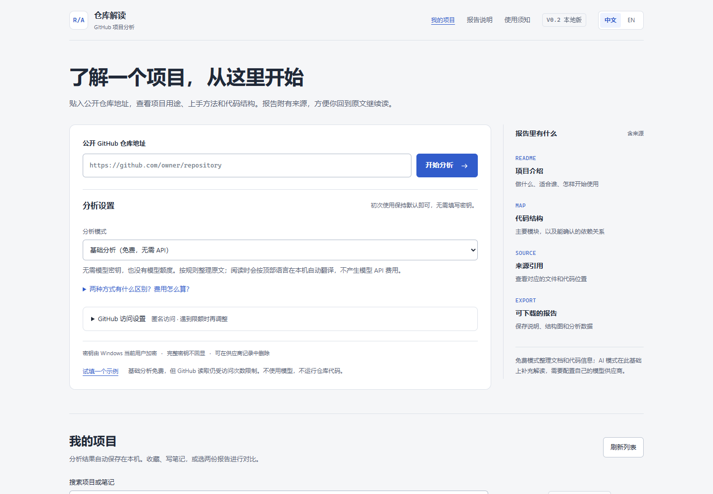
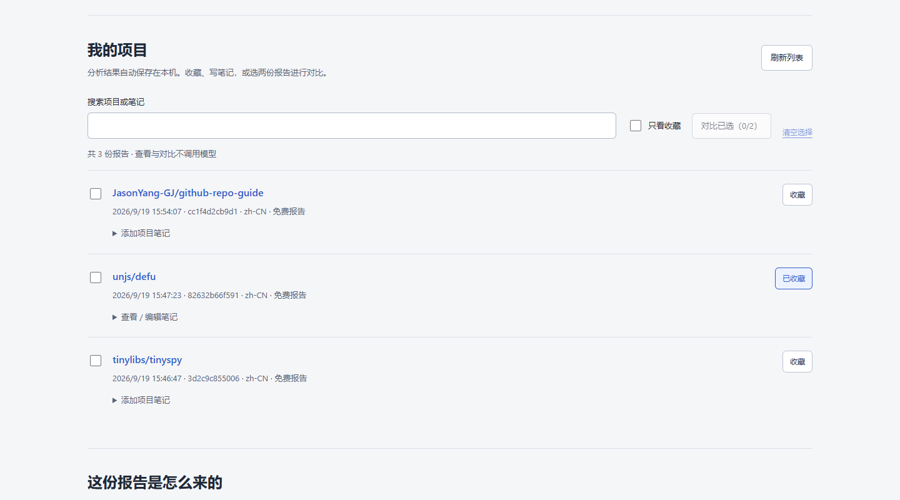
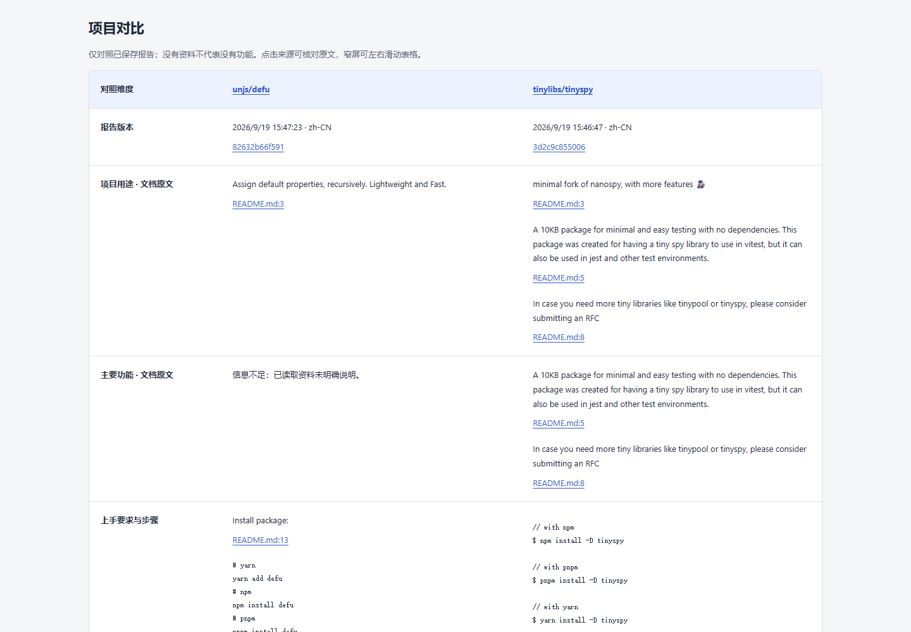

# GitHub Repo Guide

**Turn public GitHub repositories into source-linked reports, then build a local project library with history, favorites, notes and side-by-side comparison.**

For developers exploring unfamiliar projects, people learning from open source, and teams doing an initial technical review. Basic analysis needs no API key; connect your own model API for deeper interpretation. Reports can be read in Chinese or English, with on-device translation in compatible browsers.

[简体中文](README.md) · [Model setup](docs/model-providers.md) · [Security](SECURITY.md)



## Updated interface

**My projects** keeps successful reports available across restarts. Search by project or note, favorite a candidate, and reopen its report without repeating analysis.



**Compare two reports** to inspect documented purpose, features, setup, source references and reading limits. Missing evidence is labelled explicitly; comparison makes no model calls and does not automatically rank projects.



Screenshots show the real local interface with free analyses of public repositories. They contain no model keys or private note bodies. Comparison excerpts stay in their original language; the comparison does not translate them or generate new conclusions.

## Start locally

Requires Node.js 20+, npm, Git and network access to GitHub.

```sh
git clone https://github.com/JasonYang-GJ/github-repo-guide.git
cd github-repo-guide
npm ci --ignore-scripts
npm run web
```

Open **http://127.0.0.1:4173**, switch to EN if needed, and paste `https://github.com/tinylibs/tinyspy`. Anonymous access and free analysis work without a model key.

This is a **V0.2 local preview**, not a hosted multi-user service. No shared API credits are included.

On Windows, after installing dependencies, run `powershell -NoProfile -ExecutionPolicy Bypass -File scripts/start-local.ps1` to build when needed, start the server in the background and open the browser. Repeated launches reuse this app; conflicting programs are never terminated.

**My projects** keeps successful reports, favorites and per-report notes under local `output/web/history/`. Select two reports for a source-linked comparison without model calls. Reports and downloads survive server restarts. Earlier download-only reports are not imported automatically. Notes and reports are not encrypted or cloud-synced; review them before sharing. Unsaved note drafts do not survive page reloads.

## What it provides

- Project purpose, documented features, audience, setup and caveats.
- Selected modules and conservative JavaScript/TypeScript import and call relationships.
- Source references pinned to one complete commit, with documentation and AI interpretation labelled separately.
- Downloadable Markdown reports, JSON data and Mermaid diagrams.
- Chinese/English interface, with free analysis or user-managed model connections.
- Persistent local report history, favorites, per-report notes and project/note search.
- Source-linked comparison of two saved reports without model calls.
- Windows background launcher with service identification and existing-instance reuse.

Free mode organizes source text using fixed rules without calling a model. AI mode adds interpretation using your API account. Supported formats are **OpenAI-compatible Chat Completions** and **Anthropic Messages**; vendors are not restricted to a predefined list. Not every protocol/model is compatible.

The UI labels these modes **Basic analysis (free, no API)** and **AI in-depth explanation (your API)**. Basic mode grants or uses no model credits; both modes use local resources and are subject to GitHub access limits, which are separate from model billing.

The top 中文 / EN switch is the only reading-language setting. Once a report is available, the page detects the source language automatically and translates when needed; there is no second source-language selector or translation button. Output targets are Chinese or English only. Translation is shown ahead of the originals, with code blocks and source links preserved. It is a reading aid, not a fact check or a whole-repository translation. Switching languages never calls a paid model, and server-generated reports and existing AI explanations are not overwritten.

Automatic detection and translation use the browser's [Language Detector API](https://developer.chrome.com/docs/ai/language-detection) and [Translator API](https://developer.chrome.com/docs/ai/translator-api), checked at runtime. First use may download on-device language packs and use bandwidth, disk space and local compute, but no API key or model API balance. Text is not sent to a cloud model. Unsupported browsers or language pairs, detection failures and failed downloads keep the original report readable without a paid fallback. Automatic translation times out after two minutes; the current-result JSON can include a separate `reading_translation` field. Server-generated artifacts remain unchanged and reloading clears temporary translations. Unsupported and mobile browsers can still read originals or use their own model API.

In AI mode, open **Manage providers**, enter a name, public HTTPS Base URL, API key, format and model IDs. The saved key is protected for the current Windows user and remains available after reload. The main page shows only its saved state and last four characters; use **Replace key** when needed. Choose the connection/model and accept its destination and charges. Configuration checks do not contact the vendor or validate authentication/balance. See the [provider guide](docs/model-providers.md).

## Privacy and limitations

- Nonsecret settings persist in this browser. API keys are encrypted with Windows DPAPI for the current Windows user and stored as ciphertext under `%LOCALAPPDATA%\GitHubRepoGuide\credentials.v1.json`; saved provider records remain usable after reload without returning the full key to the page.
- A saved key is bound to its provider Base URL and API format. Changing either retires the old binding and requires the matching key again. Keys can be deleted independently or with the provider record.
- Keys are never written to browser localStorage, reports, downloads or logs. DPAPI does not protect a compromised Windows account. Do not expose the loopback service or commit real keys.
- AI requests send repository text to your selected provider and may incur charges, including failed requests. Failed generation can fall back to a free report without paid retries.
- GitHub credentials are separate from model keys. Custom connections do not borrow environment keys.
- Only public GitHub repositories are supported. Reading is bounded; large repositories may be partially analyzed. Other languages use generic text analysis, not full language-specific call graphs.
- Target code is never cloned, installed or executed. The report is not a runtime test, security audit or guarantee of correctness.
- Custom endpoints require public HTTPS. Local/private endpoints, native Responses/Gemini APIs, OAuth-only clients and automatic proxy-environment routing are not supported.
- **Do not expose the local port publicly.** Authentication, multi-user isolation and public-service rate limiting are not implemented.
- Both model protocols have mocked transport coverage, not live paid acceptance for every vendor.

After reopening the Windows app, saved keys appear as a saved state and last four characters, not a full key in the input. Select the original provider record in the same browser profile and origin. If an older checkout is running, stop that confirmed instance before launching this updated checkout. Browser configuration does not automatically follow a different browser or port.

Reports are stored in `output/web/runs/` and excluded from Git. If port 4173 is occupied, set the `PORT` environment variable to `4174` before starting.

## Development

```sh
npm run typecheck
npm test
```

Tests use local fixtures and simulated APIs; no real credentials or paid calls are required. The web suite is available via `npm run test:web`.

The CLI remains available via `npm run cli -- analyze https://github.com/owner/repo --output output --provider deterministic`. Its legacy content-research interfaces are separate from the web experience. Historical private experiment outputs and their replay tests are not distributed in this public snapshot.

[Public scope](docs/public-scope.md) · [Architecture](docs/architecture.md) · [Contributing](CONTRIBUTING.md) · [Changelog](CHANGELOG.md)

## License

[MIT](LICENSE). Dependencies retain their licenses. Analyzed repository code and excerpts remain subject to their original licenses; publishing a generated report does not relicense them.
